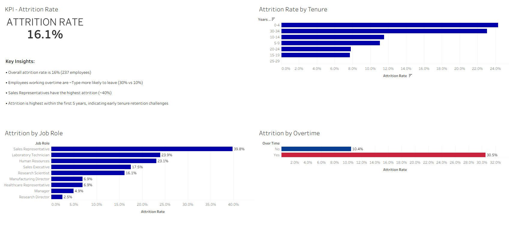

# 📊 Employee Attrition Analysis

## 📌 Overview
This project analyzes employee attrition to identify key drivers of turnover and provide actionable insights for improving retention.

Using HR data, I analyzed patterns in employee tenure, job roles, and overtime to identify where and why attrition is highest.

---

## 🎯 Objective
- Analyze employee attrition trends
- Identify high-risk groups
- Provide data-driven insights to support retention strategies

---

## 🛠️ Tools & Technologies
- Excel (data exploration & preperation)
- SQL (BigQuery - data analysis & aggregation)
- Tableau (data visualization)

---

## 📂 Dataset
HR Employee Attrition dataset including employee demographics, job role, tenure, and work conditions.

---

## 📊 Key Metrics
- Attrition Rate
- Attrition by Job Role
- Attrition by Tenure
- Attrition by Overtime Status

---

## 🔍 Key Insights
- Overall attrition rate is **16%**
- Employees working overtime are **~3x more likely to leave (30% vs 10%)**
- Sales Representatives have the highest attrition (~40%)
- Attrition is highest within the first 5 years

---

## 📈 Dashboard
 
---

## 🧠 Business Impact
- Reducing overtime may lower employee burnout and turnover
- Early tenure retention strategies can improve employee longevity
- High-turnover roles may require targeted engagement strategies

---

## 🚀 Future Improvements
- Build predictive model for attrition
- Incorporate satisfaction and performance data
